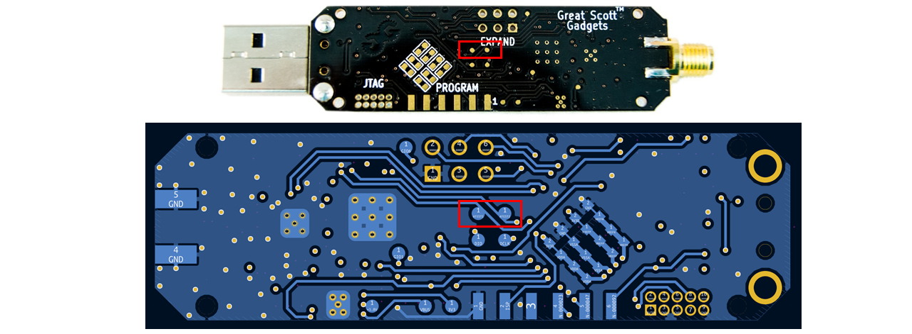
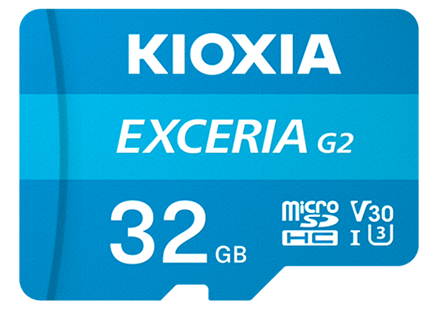

BoRa ADC Sampling Code
=======

This is an example to use a **NUCLEO-F722ZE** to sample the I/Q signals output from the Ubertooth One with the high-frequency ADCs. The raw data will be sampled and stored into a TF card.

### Signal Wires
The Ubertooth One provides two contacts on the back of the PCB to connect with the `ATEST1` and `ATEST2` on the CC2400 chip, respectively. The `ATEST1` (Q path) is connected ti A1 pin (PC0 on the NUCLEO-F722ZE board) and `ATEST2` (I path) is connected to A0 pin (PA3 on the NUCLEO-F722ZE board). You can also change ports by modifying `adc_config` in `boards/nucleo-f722ze/include/periph_conf.h`.
The SD card adapter is connected to the `SDMMC` ports on the NUCLEO-F722ZE.

### Reading Data from SD Card
After data collection, you can use the `blkreader.py` to read the raw I/Q data from the SD card. Reminder to update `disk = open("/dev/sdd", "rb")` with the correct path to the SD card. 

P.S.
For now, we find the current RIOT-OS does not support TF card well. Some of the TF cards are not compatible with RIOT-OS. In our experiment, we use a KIOXIA EXCERIA G2 32GB V30 U3. 

